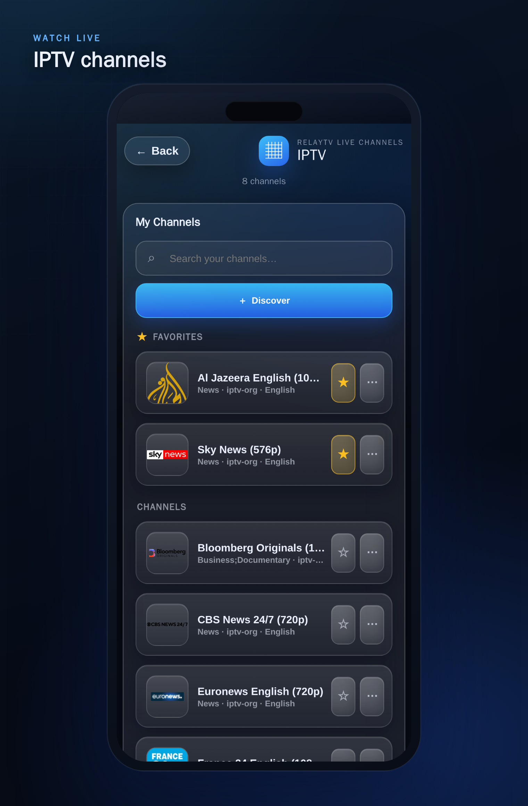

<p align="center">
  
</p>

<h1 align="center">Make your Linux box the TV.</h1>

<p align="center">
  RelayTV is a local-first playback endpoint for a Linux device connected over
  HDMI. Phones, browsers, media servers, Home Assistant, and automations tell
  the box what to do; the box does the playing.
</p>

<p align="center">
  <a href="#install-in-minutes"><strong>Install RelayTV</strong></a> ·
  <a href="https://relaytv.app/integrations/"><strong>Explore integrations</strong></a> ·
  <a href="https://relaytv.app/docs/"><strong>Read the docs</strong></a>
</p>

<p align="center">
  <a href="https://github.com/mcgeezy/relaytv/actions/workflows/ci.yml"></a>
  <a href="https://github.com/mcgeezy/relaytv/pkgs/container/relaytv"></a>
  <a href="https://github.com/mcgeezy/relaytv-ha"></a>
  <a href="https://github.com/mcgeezy/relaytv-android"></a>
</p>

<p align="center">
  
</p>

<p align="center">
  <strong>Local-first</strong> · No RelayTV account · No app telemetry · No
  cloud dependency for core playback
</p>

## Play. Browse. Control. Automate.

### ▶️ Play

Paste a media URL into the Web UI, share a link or local audio/video file from
[Android](https://github.com/mcgeezy/relaytv-android), or upload media through
[Home Assistant](https://github.com/mcgeezy/relaytv-ha). RelayTV owns playback,
durable queue advancement, history, temporary interruption/resume, and on-TV
notifications beside the screen.

### 🎬 Browse

Explore Jellyfin or Emby from a responsive library built for phones and
desktops, then launch playback on the connected display. Connect Seerr to
discover upcoming movies and series, follow request status, and request them
under an explicit administrator or caller-specific identity. Bring optional
IPTV playlists, curate **My Channels**, and favorite live sources you use.

### 🎛️ Control

Use the responsive Web UI from any browser. The Android app adds separate Play
and Queue share targets, native media controls, mDNS discovery, and profiles for
multiple RelayTV screens. RelayTV devices can also send a queue or active
playback to one another on the local network.

### 🏠 Automate

Make every screen a Home Assistant `media_player`, or use the local HTTP API
from scripts, dashboards, services, and agent workflows. Smart play, temporary
media, overlays, snapshots, direct uploads, and synchronized multi-screen starts
all keep the playback engine beside the TV.

## See it in action

<table>
  <tr>
    <td width="50%" valign="top">
      
    </td>
    <td width="50%" valign="top">
      
    </td>
  </tr>
  <tr>
    <td valign="top">
      <h3>Everything you need from the couch</h3>
      Play, pause, seek, change volume, manage the queue, resume history, and
      send something new without taking over the television UI.
    </td>
    <td valign="top">
      <h3>Your Jellyfin or Emby library, beautifully connected</h3>
      Scroll Home rails, search bounded catalogs, browse rich series pages,
      choose seasons, and start or queue media on the TV.
    </td>
  </tr>
  <tr>
    <td width="50%" valign="top">
      
    </td>
    <td valign="middle">
      <h3>Live TV, curated the way you watch</h3>
      Add M3U playlists or pick from the free-provider directory, then build a
      <strong>My Channels</strong> list, pin favorites to the top, and send a
      live channel to the TV — all from the same phone remote.
    </td>
  </tr>
</table>

<p align="center">
  
</p>

### A living-room endpoint—not another casting dependency

RelayTV runs on the Linux device connected to the display. It owns playback,
queue advancement, history, overlays, and the idle dashboard locally, while
companion apps and automations remain optional ways to control it.

See the [product overview](https://relaytv.app/product/) for the complete system
model and real [cross-device workflows](https://relaytv.app/demo/).

## Install in minutes

RelayTV is built for 64-bit Raspberry Pi-class devices, Intel mini PCs, NUCs,
HTPCs, and other `amd64` or `arm64` Linux hosts connected directly to a
television. The installer can set up Docker with your approval when needed.

```bash
mkdir -p ~/relaytv
cd ~/relaytv
curl -fsSL https://raw.githubusercontent.com/mcgeezy/relaytv/main/install.sh | bash
```

Then open `http://YOUR_RELAYTV_HOST:8787/ui` from a phone or desktop browser.

Need runtime choices, hardware notes, or an existing source checkout? See the
[complete installation guide](docs/INSTALL.md), or follow the public
[getting-started path](https://relaytv.app/docs/getting-started/).

## Made for the stack you already own

- **[Home Assistant](https://github.com/mcgeezy/relaytv-ha)** — entities,
  services, automations, and dashboard workflows.
- **[RelayTV for Android](https://github.com/mcgeezy/relaytv-android)** — share
  links directly to the TV and control playback from your phone.
- **Jellyfin and Emby** — responsive Home, Movies, TV, series, season, episode,
  search, resume, and queue workflows.
- **Seerr** — discovery, search, request tracking, deliberately selected
  request identity, and validated playback of available Jellyfin media.
- **IPTV / M3U** — opt-in live sources, curated My Channels, favorites, and
  availability checks.
- **HTTP API** — local automation from shell scripts, dashboards, services, and
  custom applications.

The core server does not require a RelayTV cloud account. It is designed for a
trusted LAN; use a VPN or authenticated reverse proxy rather than exposing the
API directly to the public internet.

## For operators and developers

| Start here | Reference |
| --- | --- |
| [Installation](docs/INSTALL.md) | [HTTP API](docs/API.md) |
| [Native runtime operations](docs/NATIVE_RUNTIME_OPERATIONS.md) | [Jellyfin/Emby operations](docs/JELLYFIN_OPERATIONS.md) |
| [IPTV operations](docs/IPTV_OPERATIONS.md) | [Seerr operations](docs/SEERR_OPERATIONS.md) |
| [Device sync operations](docs/DEVICE_SYNC_OPERATIONS.md) | [Architecture](docs/ARCHITECTURE.md) |
| [Public documentation](https://relaytv.app/docs/) | [Release process](docs/RELEASE.md) |

The [documentation map](docs/README.md) links the remaining runbooks and
machine-checked inventories.

## Project and support

RelayTV is open-source software licensed under the
[GNU General Public License v3.0](LICENSE). RelayTV artwork and marks are
covered by the [asset and trademark policy](ASSETS.md).

If RelayTV makes your living-room setup better, you can help by
[starring the repository](https://github.com/mcgeezy/relaytv), sharing it with
another self-hoster, or [supporting development](https://buymeacoffee.com/relaytv).
