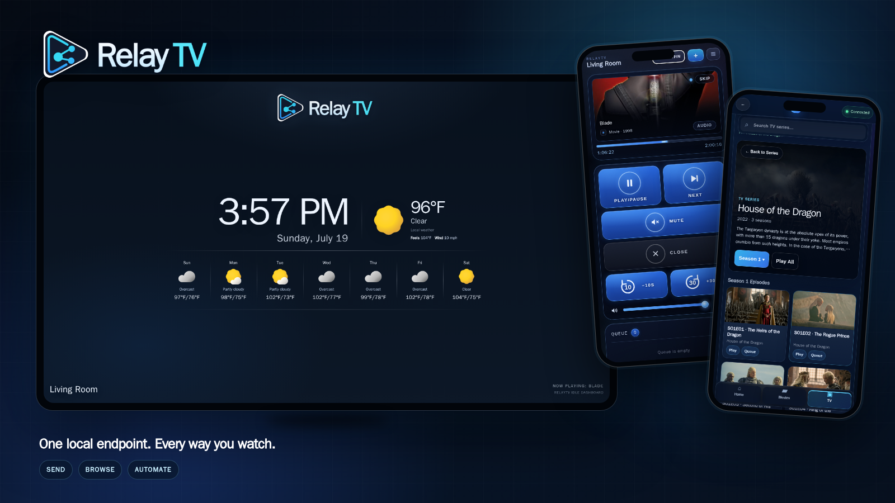
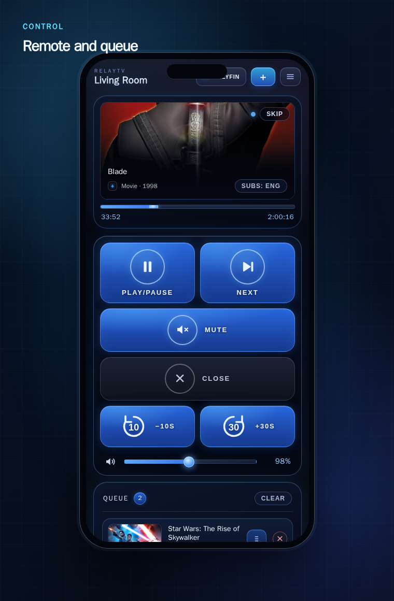
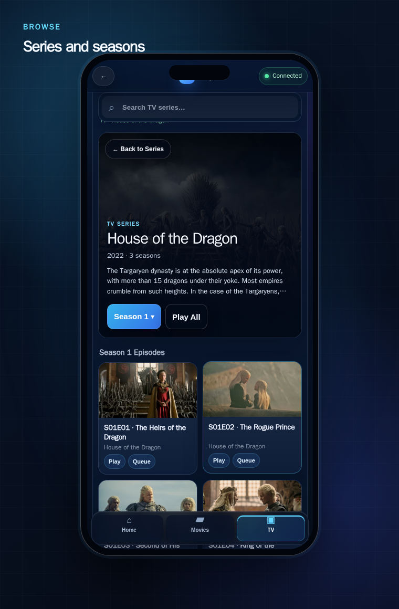
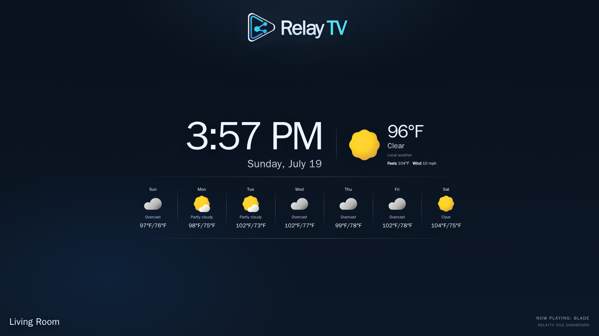

<p align="center">
  
</p>

<h1 align="center">Your media. Your TV. Your rules.</h1>

<p align="center">
  Turn a Linux box into a local playback target you can control from your
  phone, Jellyfin, Home Assistant, scripts, and companion apps.
</p>

<p align="center">
  <a href="#install-in-minutes"><strong>Install RelayTV</strong></a> ·
  <a href="#see-it-in-action"><strong>See it in action</strong></a> ·
  <a href="docs/README.md"><strong>Read the docs</strong></a>
</p>

<p align="center">
  <a href="https://github.com/mcgeezy/relaytv/actions/workflows/ci.yml"></a>
  <a href="https://github.com/mcgeezy/relaytv/pkgs/container/relaytv"></a>
  <a href="https://github.com/mcgeezy/relaytv-ha"></a>
  <a href="https://github.com/mcgeezy/relaytv-android"></a>
</p>

<p align="center">
  
</p>

<p align="center">
  <strong>Local-first</strong> · No RelayTV account · No tracking · No cloud
  dependency for core playback
</p>

## One box. Every way you watch.

### 🔗 Send it

Paste a media URL into the Web UI from any phone or computer. For one-tap
sharing, use **RelayTV Play** or **RelayTV Queue** from the
[Android Companion App](https://github.com/mcgeezy/relaytv-android), or send links
through the Home Assistant Companion app with the
[`mobile_app.share` automation](https://github.com/mcgeezy/relaytv-ha#home-assistant-companion-app-share-automation).

### 🎬 Browse it

Explore Jellyfin or Emby from a responsive library built for phones and
desktops, then launch playback on the connected display.

### 🏠 Automate it

Control playback from Home Assistant, HTTP requests, dashboards, scripts, and
agent workflows on your own network.

RelayTV keeps the playback engine beside the TV while your phone stays a
lightweight remote. Queues survive restarts, playback advances automatically,
and every control surface speaks to the same local endpoint.

## See it in action

<table>
  <tr>
    <td width="50%" valign="top">
      
    </td>
    <td width="50%" valign="top">
      
    </td>
  </tr>
  <tr>
    <td valign="top">
      <h3>Everything you need from the couch</h3>
      Play, pause, seek, change volume, manage the queue, resume history, and
      send something new without taking over the television UI.
    </td>
    <td valign="top">
      <h3>Your Jellyfin or Emby library, beautifully connected</h3>
      Scroll Home rails, search bounded catalogs, browse rich series pages,
      choose seasons, and start or queue media on the TV.
    </td>
  </tr>
</table>

<p align="center">
  
</p>

### A living-room endpoint—not another casting dependency

RelayTV runs on the Linux device connected to the display. It owns playback,
queue advancement, history, overlays, and the idle dashboard locally, while
companion apps and automations remain optional ways to control it.

## Install in minutes

RelayTV is built for Raspberry Pi-class devices, Intel mini PCs, NUCs, HTPCs,
and other Linux hosts connected directly to a television.

```bash
mkdir -p ~/relaytv
cd ~/relaytv
curl -fsSL https://raw.githubusercontent.com/mcgeezy/relaytv/main/install.sh | bash
```

Then open `http://YOUR_RELAYTV_HOST:8787/ui` from a phone or desktop browser.

Need runtime choices, hardware notes, or an existing source checkout? See the
[complete installation guide](docs/INSTALL.md).

## Made for the stack you already own

- **[Home Assistant](https://github.com/mcgeezy/relaytv-ha)** — entities,
  services, automations, and dashboard workflows.
- **[RelayTV for Android](https://github.com/mcgeezy/relaytv-android)** — share
  links directly to the TV and control playback from your phone.
- **Jellyfin and Emby** — responsive Home, Movies, TV, series, season, episode,
  search, resume, and queue workflows.
- **HTTP API** — local automation from shell scripts, dashboards, services, and
  custom applications.

The core server does not require a RelayTV cloud account. It is designed for a
trusted LAN; use a VPN or authenticated reverse proxy rather than exposing the
API directly to the public internet.

## For operators and developers

| Start here | Reference |
| --- | --- |
| [Installation](docs/INSTALL.md) | [HTTP API](docs/API.md) |
| [Native runtime operations](docs/NATIVE_RUNTIME_OPERATIONS.md) | [Jellyfin/Emby operations](docs/JELLYFIN_OPERATIONS.md) |
| [Architecture](docs/ARCHITECTURE.md) | [Release process](docs/RELEASE.md) |

The [documentation map](docs/README.md) links the remaining runbooks and
machine-checked inventories.

## Project and support

RelayTV is open-source software licensed under the
[GNU General Public License v3.0](LICENSE). RelayTV artwork and marks are
covered by the [asset and trademark policy](ASSETS.md).

If RelayTV makes your living-room setup better, you can help by
[starring the repository](https://github.com/mcgeezy/relaytv), sharing it with
another self-hoster, or [supporting development](https://buymeacoffee.com/relaytv).
