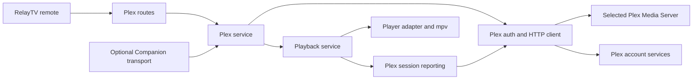

# Plex integration findings and implementation plan

Status: implementation in progress on `feat/plex-account-foundation` in PR
#93. The original review used RelayTV `main` at `5a671f3` (0.10.3). The account,
browser, direct-play, transcoding, quality, track, and reconnect foundations
are implemented; Pi acceptance and the optional controller phase remain.
Live checks from 2026-09-05 through 2026-09-07 exercised a local Plex Media
Server and the start of Plex's current PIN/JWK flow, as recorded below. Full
account approval and controller compatibility remain to be demonstrated.

This document is retained at the maintainer's explicit request. It tracks the
remaining work and evidence; [PLEX_OPERATIONS.md](PLEX_OPERATIONS.md) documents
the account and server settings that are already implemented.

## Recommended product scope

Deliver a Plex personal-library client inside RelayTV: account linking,
server selection, movies and episodes, search, resume, queue actions, track
selection, and playback/watch-state reporting. Start with one linked account
and one selected server per RelayTV installation, with data structures that
keep account and server identity explicit. Plex and Jellyfin can be configured
at the same time; the existing single-player arbitration still applies.

Treat receiving casts from Plex apps as a separate, optional workstream.
Run its compatibility spike early, but do not make basic library playback
depend on its outcome. The first release can be useful through RelayTV's own
remote even if a current Plex controller cannot discover a third-party player.

Defer Plex Home user switching, caller-specific accounts, multi-server search,
Plex Discover/Watchlist, ad-supported Plex content, Live TV/DVR, downloads,
music/photo libraries, and Seerr's Plex playback bridge. These need their own
identity, content, or queue decisions. A bundled Plex badge identifies library
items; matching `plex.tv` alone must not imply a playable personal-library item.

## Findings and evidence

### Current Plex interfaces

Plex publishes a PMS OpenAPI specification, currently version 1.2.2. It
documents JSON responses, client identity headers, feature discovery, catalog
operations, playback decisions, play queues, and timeline reporting. The API
version header is separate from the server version. Implementation should
pin an exercised API contract and verify the corresponding minimum PMS version;
the document version alone is not a tested compatibility claim.
[PMS API](https://developer.plex.tv/pms/)

For new apps Plex recommends a PIN/JWK flow using Ed25519 and renewable,
seven-day JWTs. Account resources supply server connections and access tokens.
Prefer local connections and use relay only as a last resort. The modern
authentication description also discusses direct JWT use against PMS; shared
server token behavior needs a captured fixture before choosing credentials.
[Authentication](https://developer.plex.tv/pms/#section/API-Info/Authenticating-with-Plex)

The official Companion specification describes player advertising, HTTP
commands, subscriptions, timelines, and server play queues, but lives in the
archived Plex Media Player project. It establishes a historical implementation
reference, not a guarantee for current clients.
[Companion specification](https://github.com/plexinc/plex-media-player/wiki/Remote-control-API),
[archive status](https://github.com/plexinc/plex-media-player)

Plex's supported Companion apps page explicitly excludes mobile versions
2025.10 and higher from its coverage. Therefore, neither current Android nor
iOS receiver discovery is proven by the old compatibility list. Record exact
controller versions in the spike.
[Supported Companion apps](https://support.plex.tv/articles/203082707-supported-plex-companion-apps/)

Plex documents subscription requirements for remote personal-video playback
on affected platforms. Local playback is distinguished from remote playback,
and networking can cause apparently local connections to count as remote.
RelayTV must surface server decisions and access failures honestly; the
applicability to a third-party RelayTV client requires verification rather
than an assumption of entitlement or exemption.
[Remote playback requirements](https://support.plex.tv/articles/requirements-for-remote-playback-of-personal-media/)

### RelayTV integration points

| Existing surface | Finding and planned use |
| --- | --- |
| [Architecture](ARCHITECTURE.md), `playback_service.py` | Preserve ownership of transitions, queue advancement, stop, and resume. Plex sends commands through this service. |
| `integrations/jellyfin_service.py`, `jellyfin_receiver.py`, `jellyfin_ws.py` | Reuse the separation of product behavior and transport. Plex requires a distinct protocol adapter; copying Jellyfin session registration would be incorrect. |
| `integrations/seerr_client.py`, `seerr_sessions.py` | Useful patterns for bounded transport, safe errors, and short-lived browser linking flows. Plex account credentials need durable storage beyond a browser session. |
| `config.py`, `state.py`, `routes/settings.py`, `main.py` | Settings cross defaults, persistence, client serialization, runtime snapshots, live apply, and startup/shutdown. Cover all of these in the configuration milestone. |
| `device_identity.py` | Derive a stable Plex client identifier from the install identity. Device renaming changes the label; losing durable identity must not silently create a new linked device on each restart. |
| `state.py`, `routes/queue.py`, `player.py` | Queue/history/session persistence and replay contain explicit provider fields and URL assumptions. Adding a Plex catalog route alone will not make resume or queued playback work. |
| `public_media.py` | Current sensitive query keys omit `X-Plex-Token`. Add Plex credential forms before accepting Plex links or emitting Plex metadata anywhere public. |
| `player.py` | Existing item HTTP headers handle User-Agent/Referer. General authenticated Plex media delivery needs an explicit implementation and checks for native Qt, external mpv, restart, and seamless replacement. |
| `thumb_cache.py`, `routes/assets.py` | Artwork must be fetched with server-side credentials and exposed as a local resource. Do not put a Plex token into an image URL sent to the browser. |
| `peers.py`, `routes/peers.py` | Transfers rebuild from safe URLs and discard provider secrets. Plex item references need a compatible transfer contract or a clear unavailable action. |
| `static/ui/jellyfin.js`, `app.js` | Follow the existing browse/detail/queue interaction patterns. Add a dedicated Plex controller; avoid a wholesale UI framework migration. |

## Proposed design

### Settings and identity

Settings → Plex should contain separate sections:

- **Plex account:** Link Plex account, linked account display name, reconnect,
  and unlink. Authentication happens on Plex's page; RelayTV does not collect
  Plex passwords. Explain that library visibility and watched progress use
  the account linked to this TV.
- **Library server:** choose an accessible server and show connection state.
  An advanced address override must verify the selected server's identity.
  Report secure local, remote, or relay transport accurately.
- **Playback:** automatic/direct/transcode preference and language choices,
  with unsupported options disabled and reasons shown.
- **Receive casts from Plex apps:** a separate control only after the receiver
  milestone passes. Library linking must stay visible and functional when
  receiving is disabled. Do not invent a Jellyfin-style shared API-key mode.

Proposed persisted non-secret fields are `plex_enabled`,
`plex_server_machine_id`, `plex_server_url_override`, `plex_playback_mode`,
`plex_audio_lang`, and `plex_sub_lang`. A later `plex_receiver_enabled` defaults
to false. Only add environment defaults that operators need, through
`config.py`; keep keys, tokens, and browser flow state out of subprocess env.

Store the device private key, linked-account binding, and tokens in a versioned
private file under RelayTV's state directory, atomically written with mode
0600. A failed write must produce a visible failure rather than a successful
link that disappears after reboot. Return only configured/linked/expiry
status to public clients. Document backup, unlink, and cloned-device behavior.
`RELAYTV_API_TOKEN` remains env-only under its existing contract.

Use browser-bound, expiring flow IDs for link initiation and completion. Keep
PIN exchange and token refresh on the backend. Serialize refresh work, retry
with bounded backoff, and distinguish expired/revoked credentials from an
unreachable Plex service. Do not erase credentials on a timeout. Unlink or
reconfiguration invalidates in-flight work so a late response cannot restore
an old account. Specify whether unlink revokes upstream or only removes local
credentials after the available revocation API is verified.

For the first release, an operator-linked account is a device-wide identity,
consistent with RelayTV's existing LAN model. It is not a Plex Home permission
boundary between different people using the same RelayTV remote. Account
switching must stop that account's active playback through the playback
service and prevent old queued references from resolving as the new user.

### Modules and data flow

Planned modules and their current state:

| Module | Current state and responsibility |
| --- | --- |
| `integrations/plex_client.py` | Implemented for bounded HTTP requests, verified server connections, safe Plex errors, and response parsing. |
| `integrations/plex_auth.py` | Implemented for durable device keys and credentials, PIN flow, refresh, and account lifecycle. |
| `integrations/plex_service.py` | Implemented for catalog normalization, scoped references, playback policy, queue items, media decisions, conversion sessions, tracks, and watch-state payloads. |
| `integrations/plex_companion.py` | Planned optional advertising, command normalization, subscriptions, controller timeline transport, and registered command-sink integration. |
| `routes/plex.py` | Implemented for status, linking lifecycle, server discovery/selection, connection testing, catalog, artwork/media relays, playback actions, write guards, and private response handling. |
| `static/ui/plex.js`, `plex.css` | Implemented for Home, libraries, paging, search, detail, seasons/episodes, progress display, version/track choices, playback actions, and responsive browser layouts. Settings remain in the shared settings controller and styles. |

Use a narrow HTTP client initially; the existing Python stack already supports
HTTP transport. Decide the JWT/Ed25519 dependency during the first spike,
declare it in both package and container installation paths, and use a
maintained implementation. Do not hand-roll signature primitives. Evaluate
Python PlexAPI only against the needed modern auth and transport contracts;
an SDK does not by itself implement a receiver.

### Catalog, references, and playback

Proposed upstream calls, subject to the initial contract capture: feature
discovery at `/media/providers`; hubs/search/continue-watching; metadata and
section item keys; decision/start; media parts; stream selection; and timeline.
Resolve returned feature and child keys against a validated origin. An
absolute key is not permission to forward credentials to another host.
[PMS operation reference](https://developer.plex.tv/pms/)

Normalize a durable reference using server machine identifier, provider
identifier, metadata key/rating key, and account binding. Keep selected media
version and part identity distinct from that item reference. Preserve RelayTV's
unique `queue_id` for duplicate queue entries; do not equate it with Plex's
`playQueueItemID`. Scope catalog and artwork caches by account and server.

Implement re-resolution at every entry point: initial play, queue autoplay,
history replay, resume after restart, and track/quality changes. Persist only
durable references and safe display metadata. Do not persist expiring streams,
transcode sessions, account tokens, or controller-provided credentials in
queue/history/session JSON. Keep synthetic references out of yt-dlp and generic
URL playback. Unknown/disabled Plex references must fail clearly and preserve
the existing queue rollback behavior.

Before media starts, obtain a playback decision using the selected server and
RelayTV's measured codec/resolution/audio capabilities. Keep native Pi/arm
limits aligned with `video_profile.py`. Separate direct play, remux, and video
transcode results. Reuse a session ID across decision and start, and map seek
positions explicitly: timeline/Companion positions use milliseconds, while
the transcode offset uses seconds.

Choose authenticated media delivery after proving header handling across
mpv backends, redirects, HLS segments, subtitle fetches, and session replacement.
The preferred path uses narrowly scoped per-playback headers. If that cannot
protect credentials across redirects and resets, use a bounded local media
relay with range/seek support and a measured throughput budget. Neither choice
may expose Plex credentials to the browser or unrelated subsequent playback.

Session reporting should consume playback-service snapshots, include
buffering/playing/paused/stopped transitions and periodic progress, and ignore
retired generations. Keep final-stop reporting distinct from explicit
mark-watched actions. Verify end-of-media, partially watched resumes, crashes,
and cross-provider replacements against the Plex server's resulting state.
Transcoder cleanup and keepalive APIs were not established by this review;
identify and test them before enabling transcoding.

RelayTV owns mixed-provider queue order in the first release. A Companion
queue requires a later explicit ownership bridge for Plex window refreshes,
duplicate IDs, edits, next/previous, and stop semantics. Never advertise queue
capabilities just because RelayTV already has a queue.

### Public routes and transport constraints

Candidate RelayTV endpoints; these are proposals, not supported API paths:

| Surface | Candidate paths |
| --- | --- |
| Status and linking | `GET /integrations/plex/status`; `POST /integrations/plex/auth/start`, `/auth/poll`, `/auth/cancel`, `/disconnect` |
| Server selection | `GET /plex/servers`; `POST /integrations/plex/server` and `/test` |
| Browsing | `GET /plex/home`, `/libraries`, `/search`, `/items/{item_id}`, `/items/{item_id}/children` |
| Item actions | `POST /plex/items/action` with play-now, play-next, play-last, resume |
| Tracks and artwork | `GET /plex/audio/options`, `/subtitle/options`, `/artwork/{asset_id}`; `POST /plex/audio/select`, `/subtitle/select` |

Use an encoded/opaque item ID that resolves to the validated composite
reference. Public methods accept IDs and bounded options, not arbitrary PMS
paths or URLs. Keep linking writes behind RelayTV's write guard and bind
flow responses to the initiating browser. Avoid returning raw Plex resource
documents. Report safe, stable error codes and mark private responses no-store.

For server connections, prefer certificate-verified advertised HTTPS names
including `plex.direct`. Never fix an IP/certificate mismatch by globally
turning verification off. Explicit local HTTP fallback can be an operator
choice. Bound connection probes and timeouts; verify machine identity on
failover; prevent redirects from carrying credentials across origins.

Companion GET controls and callback subscriptions are a separate trust
boundary from RelayTV's ordinary REST routes. The spike must establish real
controller authentication, target validation, CORS behavior, callback address
validation, and compatibility with a configured `RELAYTV_API_TOKEN`. A client
identifier or source address alone is not an authenticated controller. Do not
open unauthenticated `/player/*` controls merely to make the picker work.

## Delivery phases and acceptance gates

| Phase | Status | Deliverable | Exit evidence |
| --- | --- | --- | --- |
| 0 — contract and compatibility spikes | Partial | Small unshipped harness for JWT linking/refresh, server discovery, browse, media decision/part, reporting, plus independent Companion discovery probe. Record exact PMS/controller versions and sanitized fixtures. | Successful request/response evidence; verified minimum PMS/API contract; selected media-auth mechanism; receiver supported/unsupported matrix. A receiver failure does not block the library track. |
| 1 — account and server foundation | Implemented; final live approval checks pending | Auth/client modules, private persistence, settings/live apply, server selection, status, lifecycle. Disabled by default. | Link/cancel/expire/unlink/restart; revocation vs outage; concurrent refresh; account/server change during blocked I/O; no secrets in responses, logs, persistence exports, or environment. |
| 2 — library browser | Implemented; shared-account and device-layout checks pending | Home, libraries, search, movie/show/season/episode details, local artwork, pagination, metadata normalization. | Owner/shared-account visibility; duplicate titles across libraries; missing art; bounded large-library paging; canceled search and stale-account cache tests; phone and desktop browser checks. |
| 3 — playback and queue | Partial — direct playback, queue, timeline reporting, and amd64 native-runtime acceptance implemented | Direct play, explicit resume/start-over, durable references, queue/history/session replay, progress/stopped reporting. | Cold start and seamless replace on amd64 and Pi; seek/pause/stop/end; repeated items; failed-play rollback; restart re-resolution; mixed Plex/Jellyfin/URL queue. Peer transfer is hidden with a clear reason until reference exchange is implemented. |
| 4 — compatibility and release | Partial — media-version, server transcoding, bitrate, embedded-track controls, and server reconnect implemented | Remux/transcode lifecycle, audio/subtitle selection, quality limits, connection recovery, operator runbook. | Direct/remux/transcode fixtures plus real media; multi-version/part handling or explicit rejection; embedded/external/burned subtitles; server restart, expired token, and abandoned-transcode cleanup. No silent fallback to the wrong user or version. |
| 5 — optional Companion receiver | Planned | Verified discovery, registered ingress, bounded commands/subscriptions, timeline responses, queue ownership bridge. | Current Plex Web and available Android/iOS versions tested separately; two RelayTV boxes; controller switch/disconnect; duplicate commands; stale generation; no weakened REST auth. Advertise only demonstrated controls. |

Phases 1–4 form the first library release. Phase 5 can ship later or remain
experimental if current controllers cannot reliably use it. Keep all phases
on the unified branch and PR, with reviewable commits and explicit phase
evidence. Split media delivery from UI work at the commit boundary when useful.

### Phase 1 evidence recorded 2026-09-05

Phase 1 now includes an Ed25519 device key and modern PIN/JWK linking flow,
browser-bound expiring link sessions, serialized JWT refresh, atomic private
state persistence with mode 0600, safe resource discovery, verified server
selection, settings UI, no-store integration routes, and an operator runbook.
Unit, route, JavaScript, redaction, concurrency, and lifecycle coverage passed
with the repository's complete quality gates. Revert proofs confirmed that
the link-generation and refresh-serialization tests fail when their production
guards are removed.

A local `lscr.io/linuxserver/plex` server running PMS
`1.43.3.10828-00f62d37d` returned identity, movie/show library sections,
media providers, and one owned server resource. RelayTV selected a secure
local `plex.direct` connection and verified its machine identifier. Plex's
cloud service accepted two modern strong-PIN/JWK starts and returned the
expected 1800-second flow expiry. An isolated RelayTV runtime completed a
start/cancel request through HTTP, set an HttpOnly/SameSite browser cookie,
and wrote the private auth state with mode 0600.

The Plex account approval page was not completed, so live JWT issuance,
refresh, restart recovery, and upstream revocation are still pending. Media
decision, authenticated playback, progress reporting, and Companion discovery
were not exercised. These are acceptance inputs for the remaining phases.

### Phase 2 evidence recorded 2026-09-06

Phase 2 adds authenticated encrypted catalog and artwork references scoped to
the linked account and selected server. The read-only browser covers Home rows, movie and
TV libraries, bounded paging, search, movie/show/season/episode detail,
seasons/episodes, existing resume progress, and a credentialed no-store artwork
proxy. Account, server, or enable-setting changes retire in-flight results and
invalidate older references. The UI participates in RelayTV's browser-back
stack and retires a pending search when its tab changes.

The live PMS returned one Home row, two video libraries, a 286-movie paged
catalog, item detail with genres, search results, and JPEG artwork through the
production transport and catalog service. Sanitized results contained no
upstream `/library/` paths. Shared-account visibility, non-empty TV hierarchy,
missing-art behavior on live data, and phone/desktop browser checks remain.

### Phase 3 direct-play slice recorded 2026-09-06

Movie and episode details now provide start-over, resume, play-next, and
add-to-queue actions. Queue/history persistence keeps an encrypted item
reference scoped to the current Plex account and server, then resolves a fresh
direct media part at playback time. A range-capable loopback relay supplies the
saved server credential upstream without exposing it or the media-part path.
Durable state contains the encrypted item reference rather than the temporary
stream capability.

The production transport fetched `bytes=0-1023` from a 7.7 GB Matroska movie
on PMS `1.43.3.10828-00f62d37d`. PMS returned `206`, the exact content range,
and 1,024 bytes; the normalized playback result remained free of tokens and
raw `/library/` paths.

An isolated RelayTV process then loaded the same temporary private state on a
separate port. An encrypted item reference minted in a second process resolved
through its HTTP media route, and stock mpv completed a cold, null-output
first-frame decode in 0.92 seconds with no warnings. This demonstrates
cross-process reference stability, route-level range delivery, and decoder
compatibility without interrupting the active TV session. It does not replace
a full screen/audio device check.

Timeline reports now follow start, pause/resume, periodic playback samples,
queue transitions, stop, and natural end. Positions and durations are converted
to Plex milliseconds. Reports are serialized and throttled, and a newer state
retires an older queued report for the same playback. The ordering guard has a
revert-proof lifecycle test. Live watch-history mutation remains part of
playback acceptance rather than the non-mutating transport check.

Failed direct-part resolution is fixture-tested to leave the current queue and
runtime untouched. Persisted and interrupted items reload from their encrypted
item references, and repeated Plex entries retain distinct queue instance IDs.
The remaining Phase 3 work is a live mixed-provider queue plus Pi cold and
seamless hardware playback checks. Phase 4 still owns
remux-only behavior, selected-track live acceptance, arbitrary seeking, and
recovery across a PMS restart.

### Phase 4 media-version slice recorded 2026-09-06

Item detail now normalizes each accessible Plex media part into a safe version
choice showing resolution, container, and video codec. The browser displays a
selector only when multiple versions exist. The selected part is stored as a
second authenticated encrypted reference, separate from the item ID, and is
revalidated against the item's current media list before playback. It survives
queue, history, interrupt, and restart persistence without exposing a Plex
part path. The local 100-movie sample contained one version per title, so the
multi-version path is fixture-tested but awaits a live multi-version title.

### Phase 4 media-decision and transcode slice recorded 2026-09-06

Settings now separate Automatic, Direct play, and Always transcode behavior.
Automatic asks PMS to evaluate the selected media and RelayTV's exact
container/video/audio profile, then keeps the existing credentialed direct-file
relay when PMS accepts it. Direct-play mode remains available without a media
decision. Automatic and Always transcode require a successful decision before
the playback transition. Both the decision and start reuse one UUID,
and resume offsets are sent to PMS in seconds.

PMS's single-response HTTP Matroska transcode avoids putting credentials in mpv
headers and avoids an HLS manifest/segment rewrite proxy. The encrypted stream
capability and in-process registry bind the request to the selected account,
server, and active RelayTV process. HTTP close, stopped transitions, replacement,
natural end, and shutdown all converge on the verified universal stop endpoint.
An Original/4/8/12/20 Mbps control now participates in Automatic and forced
transcode decisions; Direct play explicitly ignores it. With a 4 Mbps limit,
the local PMS kept a 1,092 Kbps HEVC source direct and selected transcoding for
a 21,516 Kbps source. The local PMS returned
a forced H.264/AAC `video/x-matroska` stream; stock mpv
decoded its first frame through an isolated RelayTV route in 1.25 seconds, and
the explicit stop completed successfully. Live remux-only media remains.

Automatic decisions now include RelayTV's measured decoder profile rather than
assuming every source Plex advertises can be decoded locally. AV1 permission,
active display height, high-cost software codecs, bit depth, and source bitrate
can require conversion before PMS evaluates the item. A fixture pins the
copy-only remux classification. On the live host's 1080p display, the only
above-cap title in the recent 50-item sample was HEVC Dolby Vision Profile 5;
RelayTV requested conversion and PMS returned its explicit unsupported-color-
space decision instead of RelayTV attempting direct playback.

Connection recovery was exercised by stopping the otherwise idle YAMS Plex
container between requests from one authenticated `PlexClient`. The client
returned the sanitized `plex_unreachable` error during the outage, then reached
the restarted server on its fourth one-second probe with the same machine ID
and PMS `1.43.3.10896-cb3ebc72d` version. Identity and both video libraries
were available afterward. No RelayTV playback was active during the restart.

Converted-media seeking now restarts playback through the transition service
at the requested PMS offset because the single-response Matroska stream is not
byte-seekable. Relative and absolute targets preserve the queue and encrypted
version/track choices, clamp to known duration, and restore pause after the new
stream loads; direct files keep their existing player seek. A live probe
requested 600 seconds, confirmed the exact `600.0` PMS offset, and read 262,144
bytes before cleanup. A driven concurrency test confirms a superseded play
releases the exact conversion session it prepared.

### Phase 4 media-track slice recorded 2026-09-06

Item detail now normalizes numeric audio and subtitle streams for each media
version into authenticated encrypted references. The browser offers **Plex
default** audio and **Off** subtitles, refreshes the lists when the selected
version changes, and sends only opaque choices back to the action route. The
service resolves and revalidates each choice against the freshly fetched media
part before it enters durable queue or playback state, which prevents a stale
track from silently applying to another version.

Explicit audio or subtitle selection forces PMS conversion in Automatic and
Always transcode modes; selected subtitles are burned for consistent output
across mpv and the Qt shell. Direct mode returns a clear error because it
bypasses conversion. Fixture coverage verifies decision parameters, stale
version rejection, opaque browser and persisted state, UI request flow, and
queue/history/interrupt restoration. A live probe on PMS
`1.43.3.10896-cb3ebc72d` selected the embedded subtitle on the first checked
title, received a transcode decision, and read the first 262,144 bytes through
the private stream before closing and cleaning up the session. Alternate-audio,
external-subtitle, and Pi acceptance remain.

### Native device acceptance recorded 2026-09-07

The unified branch ran in the installed amd64 RelayTV compose stack with the
device's generated `/dev/dri`, `/dev/snd`, display-session, and runtime mounts.
Against PMS `1.43.3.10896-cb3ebc72d`, Automatic mode selected a live H.264/EAC3
conversion. The native Qt runtime reported active libmpv video, ALSA audio, a
known 5,856-second duration, no playback error, and an advancing clock. Pause
held the clock, resume advanced it, and replacing that conversion with a
Direct-play stream kept the native runtime active. A direct absolute seek
reached 30 seconds on its first observation.

This check exposed two production-only conversion boundaries that fixture
clients had hidden. `selected_server_session()` returns a fresh immutable
client snapshot for each request, so the transcode registry now validates its
stable account/server generation and reference key instead of requiring the
same Python client object. PMS conversion streams also restart their media
clock at zero; RelayTV now lets PMS apply the requested offset once and
projects the local clock back to the item's absolute timeline. A live
45-second conversion seek settled at 45.73 seconds, continued advancing, and
left zero PMS sessions after Stop. Replacing and stopping conversion streams
also completed without the previous expected-shutdown `IncompleteRead` ASGI
tracebacks. Revert proofs cover all three device-found boundaries.

The runtime telemetry proves the real display/audio process and device paths
were active; human-observed picture, sound quality, and lip sync were not
recorded. Pi playback, live mixed-provider queue behavior, live remux-only
media, alternate audio, external subtitles, and current Plex controller
compatibility remain open acceptance items.

### Test and release discipline

Continue focused Plex transport/auth/service/route tests, fixture-based
protocol tests, and JavaScript interaction tests as implementation proceeds.
Drive
blocked network calls through actual service/ASGI paths for race tests and
perform the repository's revert proof on every lifecycle/boundary guard.

Exercise redaction through `/settings`, status, queue, history, realtime,
thumbnails, errors, and log formatting. Include case variations of
`X-Plex-Token`, account-token fields, device JWTs, controller transient tokens,
and URLs that appear in unexpected metadata fields. Header reset tests must
prove Plex credentials cannot survive a switch to unrelated media.

Pin new routes in `test_route_inventory.py`; regenerate environment,
transition, and runtime inventories only when their surfaces actually change.
Keep the Plex containment inventory current as its route surface changes.
Keep transport imports independent of routes. Browser checks
cover focus restoration, double submissions, pagination, link cancellation,
resume choices, and distinct account/server/receiver status.

Run all `AGENTS.md` gates for each implementation PR. Hardware validation must
include cold start, not only a green unit suite. Test branch code with the
documented bind mount where dependencies are unchanged; use an image with the
new crypto dependencies installed when applicable. Preserve per-device
compose overrides and report runtime state through HTTP.

Update this plan with phase evidence as work proceeds. Normal Release Please
flow owns versions and changelogs. The first usable integration is a `feat:`
and should be reviewed for a release highlight before the unified PR merges.

## Open decisions and required test inputs

| Decision/input | Proposed default or next action |
| --- | --- |
| Plex server versions and accounts | Test a current PMS plus the intended minimum; owner and shared non-admin access. Record versions without tokens. |
| Controllers for cast support | Current Plex Web and the household's actual Android/iOS apps; discovery success must be demonstrated per version. |
| Representative media | H.264/AAC baseline, constrained-device incompatible codec, multi-audio, text/image subtitles, resumed movie/episode, duplicate library titles. |
| Auth contract and minimum version | Verify current JWT flow and shared-server credentials first. Legacy-token support is an explicit fallback decision, not the default sign-in design. |
| Secure media transport | Prove scoped mpv headers or choose the measured local relay before production playback work. |
| Receiver networking | Confirm GDM/account-resource registration requirements, usable advertised listener, container networking, controller credentials, and callback verification in phase 0. |
| Account scope | One account per TV initially. Plex Home and per-browser account switching require a later design with isolated queues/watch-state context. |
| Remote access | Local-first release; enable remote/relay only with verified transport, bandwidth, and entitlement behavior. |
| Cross-device transfer | A later peer contract exchanges durable item IDs and resolves with the destination's own account. No token transfer; access failure preserves source playback. |
| Seerr bridge | Add Plex resolution only after server/item identity is stable; the existing bridge is Jellyfin-specific. |

The live account approval, playback, and controller results described above
remain open. Do not claim those capabilities until their phase evidence has
been recorded here.
